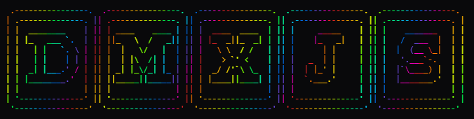

<p align="center">
  
</p>

<p align="center">
  A JavaScript module bringing DMX console-style light sliders to Home Assistant.
</p>

## Install
To install DMXJS to your Home Assistant Instance, first click the button below.<br><br>
[](https://my.home-assistant.io/redirect/lovelace_resources/)
<br><br>After this, press add resource and select 'JavaScript Module' and enter the following link:
```
https://cdn.jsdelivr.net/gh/StuffzEZ/DMXJS@main/main.js
```

## Features
- **3 card types** — single channel, full RGB, and group control
- **DMX-accurate behaviour** — all channels at 0 turns the light off, all at 255 is full white, just like a real DMX desk
- **Authentic DMX slider aesthetic** — rounded knob with line indicators and increment tick marks
- **Customisable slider colours** — per-channel colour theming for every card type
- **Config UI** — all three cards have a visual editor in the HA dashboard UI, no YAML required
- **Reactive** — cards update instantly when light state changes from any source (automations, voice, other cards)
- **Keyboard accessible** — arrow keys to step values, shift+arrow for ±10
- **Group master slider** — set all lights in a group to the same value at once
- **Brightness slider** — scales all channels proportionally across a group, compatible with individual channel cards
- **No build step** — single plain JS module, drop it in and go
- **HA 2026+ compatible**

## Cards

### `dmx-channel-card`
A single R, G, or B channel slider for one light entity.
```yaml
type: custom:dmx-channel-card
entity: light.my_rgb_light
channel: r        # r, g, or b
color: '#ff3333'  # optional — defaults to red/green/blue
name: 'Stage Red' # optional
```

### `dmx-rgb-card`
All three channels (R, G, B) for one light entity.
```yaml
type: custom:dmx-rgb-card
entity: light.my_rgb_light
color_r: '#ff3333'  # optional
color_g: '#33ff66'  # optional
color_b: '#3399ff'  # optional
name: 'Wash 1'      # optional
```

### `dmx-group-card`
Group master + brightness + per-entity RGB sliders for multiple lights.
```yaml
type: custom:dmx-group-card
name: Stage Wash
color: '#44aaff'    # master slider colour
color_r: '#ff3333'
color_g: '#33ff66'
color_b: '#3399ff'
entities:
  - entity: light.wash_left
    name: Wash Left
  - entity: light.wash_right
    name: Wash Right
```

## Requirements
- Home Assistant 2026+
- RGB-capable light entities with `rgb_color` support

> This project _is_ made with the help of generative AI.
